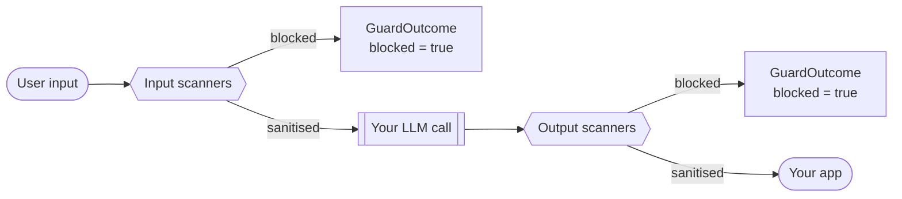

<p align="center">
  
</p>

<h1 align="center">ai_guardrails</h1>

<p align="center">
  <strong>Provider-agnostic input/output safety for Dart &amp; Flutter AI apps</strong>
</p>

<p align="center">
  <a href="https://pub.dev/packages/ai_guardrails"></a>
  <a href="https://pub.dev/packages/ai_guardrails/score"></a>
  <a href="https://github.com/GhagSagar23/ai_guardrails/actions/workflows/ci.yml"></a>
  <a href="https://pub.dev/documentation/ai_guardrails/latest/"></a>
  <a href="https://github.com/GhagSagar23/ai_guardrails/blob/master/LICENSE"></a>
  
  
</p>

---

`ai_guardrails` is a **pure-Dart** safety layer you wrap around *any* LLM call — local
(`llama.cpp`, `gemma`, ONNX) or cloud (OpenAI, Anthropic, Gemini, your own gateway).
Compose small, deterministic `Scanner`s into an `AiGuard` and it redacts PII, blocks
prompt injection and secret leakage on the way **in**, and validates model output on the
way **out**. Python has [NeMo Guardrails](https://github.com/NVIDIA/NeMo-Guardrails),
[Guardrails AI](https://github.com/guardrails-ai/guardrails), and
[LLM Guard](https://github.com/protectai/llm-guard) — this is the **first** for Dart:
pure heuristic, zero runtime dependencies, runs on any platform including mobile and web.

### Why on-device

- **EU AI Act / GDPR** — redact PII *before* the text leaves the device.
- **Privacy** — secrets and PII are stripped locally; they never reach a vendor's logs.
- **Offline & cheap** — regex/heuristic based, zero dependencies, no per-token cost.

### Use cases

| Use case | Key scanners |
| --- | --- |
| Chatbots & conversational AI | `PiiScanner`, `PromptInjectionScanner` |
| RAG applications | `GroundingScanner`, `runRetrievalStage()` |
| Code generation | `CodeExecutionScanner` |
| Streaming completions | `StreamingAiGuard` |
| Agentic tool-use pipelines | `ToolCallScanner` |
| Data loss prevention | `SecretScanner` |

## Install

Dart SDK `^3.5.0` (Flutter 3.24+) · zero runtime dependencies.

```bash
dart pub add ai_guardrails      # or: flutter pub add ai_guardrails
```

```dart
import 'package:ai_guardrails/ai_guardrails.dart';
```

## How it flows



Scanners **chain** — each sees the previous one's transformed text. The pipeline stops
at the first scanner that blocks.

## Quickstart

```dart
import 'package:ai_guardrails/ai_guardrails.dart';

final guard = AiGuard(
  inputScanners: [
    PiiScanner(action: GuardAction.redact),
    SecretScanner(),
    PromptInjectionScanner(threshold: 0.5),
  ],
  outputScanners: [
    SchemaValidator({
      'type': 'object',
      'required': ['answer'],
      'properties': {'answer': {'type': 'string'}},
    }),
  ],
);

final outcome = await guard.run(
  input: userText,
  llmCall: (sanitized) => myLlm.complete(sanitized),
);

if (outcome.blocked) {
  print('Rejected: ${outcome.blockReason}');
} else {
  print(outcome.output);
}
```

See [`example/ai_guardrails_example.dart`](example/ai_guardrails_example.dart) for a
full runnable example. Provider integration: [docs/llm-providers.md](docs/llm-providers.md).

## Scanners

31 built-in scanners. Actions: `GuardAction.{ block, redact, hash, warn, transform }`.
Findings are dotted and predictable — `pii.email`, `secret.aws_access_key`,
`injection.override` — so you can route or log by type.

| Scanner | In | Out | Default | Catches |
| --- | :---: | :---: | --- | --- |
| `PiiScanner` | ✅ | ✅ | redact | email, phone, SSN, credit card (Luhn), IBAN, IP, Aadhaar, PAN, passport + 9 locales |
| `SecretScanner` | ✅ | ✅ | block | AWS/GCP/OpenAI/Slack keys, GitHub tokens, JWTs, private-key blocks |
| `PromptInjectionScanner` | ✅ | ❌ | block | instruction-override, exfiltration, roleplay jailbreak, delimiter attacks |
| `InvisibleTextScanner` | ✅ | ❌ | redact | zero-width, bidi controls, soft hyphen, Unicode tag chars |
| `BannedTopicScanner` | ✅ | ✅ | block | word-boundary topic phrase matches |
| `BannedPatternScanner` | ✅ | ✅ | block | any `Pattern` (regex or literal) |
| `TokenLimitScanner` | ✅ | ❌ | block | prompts over approximate token budget |
| `RepetitionScanner` | ❌ | ✅ | block | degenerate output (looping / repeated phrases) |
| `UrlScanner` | ✅ | ✅ | block | IP-literal, data/JS URIs, phishing TLDs, shorteners, punycode |
| `LanguageScanner` | ✅ | ✅ | block | unexpected script/writing-system switches |
| `CodeExecutionScanner` | ❌ | ✅ | block | shell dangers, SQL destruction, eval/exec, filesystem deletion |
| `GroundingScanner` | ❌ | ✅ | warn | output not grounded in source context (keyword-overlap) |
| `SchemaValidator` | ❌ | ✅ | block | output not matching minimal JSON-Schema |
| `ToolCallScanner` | ❌ | ✅ | block | tool/function calls: name allow/deny, arg schema, injection, depth |
| `HallucinationScanner` | ❌ | ✅ | warn | cross-completion consistency via `LlmCallback` |
| `FactCheckScanner` | ❌ | ✅ | warn | NLI-style output-vs-context via `LlmCallback` |
| `TopicSafetyScanner` | ✅ | ✅ | block | LLM-judged topic adherence via `LlmCallback` |
| `PaddingAttackScanner` | ✅ | ❌ | block | context-exhaustion padding (entropy + char-run ratio) |
| `ToolOutputScanner` | ✅ | ✅ | block | XSS, SSTI, path traversal, SSRF in tool results |
| `JsonValidator` | ❌ | ✅ | block | malformed JSON, excessive nesting, oversized arrays/objects |
| `HtmlValidator` | ❌ | ✅ | block | disallowed tags, dangerous attributes, javascript: URIs |
| `SqlValidator` | ❌ | ✅ | block | disallowed SQL statements (default: SELECT only) |
| `UrlFormatValidator` | ❌ | ✅ | block | disallowed protocols, domains, credentials |
| `RangeValidator` | ❌ | ✅ | block | numeric values outside bounds, string length violations |
| `ChoicesValidator` | ❌ | ✅ | block | output not in allowed value set |
| `TopicAllowlistScanner` | ❌ | ✅ | block | output off-topic vs. positive allowlist |
| `CompetitorMentionScanner` | ❌ | ✅ | block | competitor name/product mentions |
| `BiasScanner` | ❌ | ✅ | warn | demographic bias, stereotypes |
| `PolitenessScanner` | ❌ | ✅ | warn | tone register mismatch |
| `ReadingLevelScanner` | ❌ | ✅ | warn | reading grade outside bounds (Flesch-Kincaid + Coleman-Liau) |
| `EmbeddingGroundingScanner` | ❌ | ✅ | warn | embedding cosine similarity + optional NLI entailment |

Per-scanner configuration and code examples: **[docs/scanners.md](docs/scanners.md)**.

## Performance

| Scanner | Mean |
| --- | ---: |
| BannedPatternScanner | 1.7 µs |
| BannedTopicScanner | 2.8 µs |
| SchemaValidator | 3.9 µs |
| SecretScanner | 7.8 µs |
| TokenLimitScanner | 43 µs |
| InvisibleTextScanner | 92 µs |
| PromptInjectionScanner | 98 µs |
| PiiScanner (redact) | 404 µs |
| **Full pipeline (7 scanners)** | **558 µs** |

~1.25 KB prompt, Apple Silicon. Full methodology: [BENCHMARK.md](BENCHMARK.md) ·
ReDoS analysis: [PERFORMANCE-AUDIT.md](PERFORMANCE-AUDIT.md).

## Privacy & telemetry

**Built-in heuristic scanners** (the default set) make **zero network calls** and collect
**no telemetry**. They run entirely on-device using synchronous string operations — no
data leaves the process boundary.

**LLM-assisted scanners** (`HallucinationScanner`, `FactCheckScanner`,
`TopicSafetyScanner`, `EmbeddingGroundingScanner`) use caller-provided callbacks
(`LlmCallback` / `EmbeddingCallback`) that will typically call cloud APIs. The package
itself makes no network call, but the callback you supply determines where data goes.
If you use these scanners, your privacy boundary extends to whatever service backs your
callback.

## Documentation

| Topic | Link |
| --- | --- |
| Scanner details & examples | [docs/scanners.md](docs/scanners.md) |
| LLM provider integration | [docs/llm-providers.md](docs/llm-providers.md) |
| PII redaction & round-trip | [docs/pii-round-trip.md](docs/pii-round-trip.md) |
| Streaming | [docs/streaming.md](docs/streaming.md) |
| Multi-turn sessions | [docs/multi-turn.md](docs/multi-turn.md) |
| Custom scanners | [docs/custom-scanners.md](docs/custom-scanners.md) |
| Accuracy & limitations | [docs/accuracy.md](docs/accuracy.md) |
| FAQ | [docs/faq.md](docs/faq.md) |
| API reference | [pub.dev docs](https://pub.dev/documentation/ai_guardrails/latest/) |
| Benchmarks | [BENCHMARK.md](BENCHMARK.md) |
| Performance audit | [PERFORMANCE-AUDIT.md](PERFORMANCE-AUDIT.md) |
| Roadmap | [ROADMAP.md](ROADMAP.md) |
| Contributing | [CONTRIBUTING.md](CONTRIBUTING.md) |
| Security | [SECURITY.md](SECURITY.md) |

## Contributing

Contributions are **issue-first**:
[open a GitHub issue](https://github.com/GhagSagar23/ai_guardrails/issues) before
sending a PR. See [CONTRIBUTING.md](CONTRIBUTING.md).

## License

[Apache-2.0](LICENSE) © Kryonex Labs Private Limited
